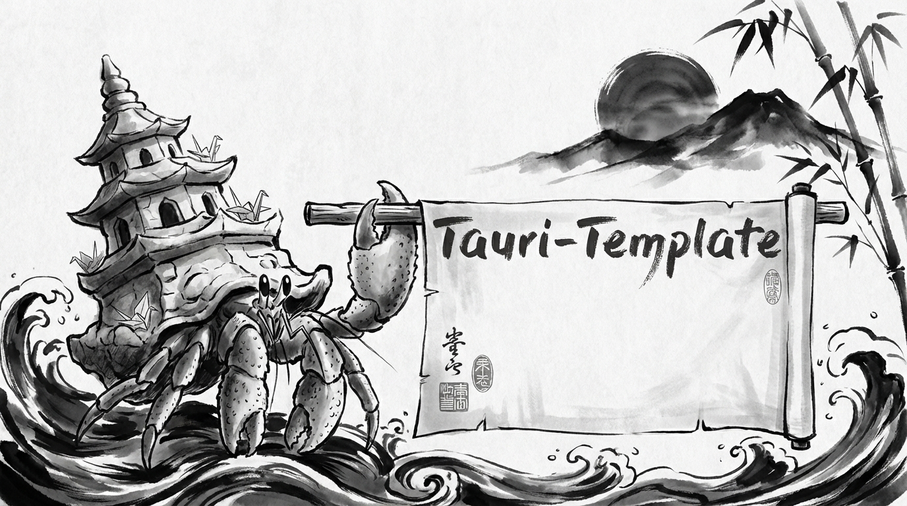
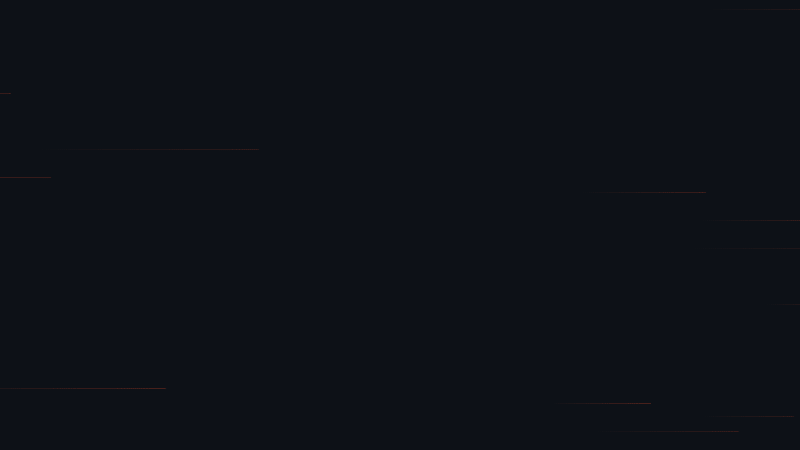

# Tauri-Template

<p align="center">
  
</p>

<p align="center">
<b>agent ready tauri template</b>
</p>

<p align="center">
  <a href="#key-features">Key Features</a> •
  <a href="#quick-start">Quick Start</a> •
  <a href="#configuration">Configuration</a> •
  <a href="#agent-skills">Agent Skills</a> •
  <a href="#credits">Credits</a> •
  <a href="#about-the-core-contributors">About the Core Contributors</a>
</p>

<p align="center">
  
  
  
  
</p>

<p align="center">
  
</p>

---

## Key Features

Modern stack for cross-platform desktop application development.

| Feature | Tech Stack |
|---------|:----------:|
| **Frontend** | React + TypeScript + Vite |
| **Backend** | Native Rust (Tauri v2) |
| **Engine** | Shared Rust crate (no Tauri dep) |
| **CLI Test Harness** | `appctl` – headless engine runner |
| **Config** | Rust `config` crate (YAML + Env) |
| **Logging** | `tracing` + Redaction Layer |
| **Package Manager** | Bun |
| **Formatting** | Biome + `cargo fmt` |

## Quick Start

1. **Initialize Project**:
   ```bash
   make init name=my-app description="My cool app"
   ```

2. **Install Dependencies**:
   ```bash
   bun install
   ```

3. **Run in Development**:
   ```bash
   bun run tauri dev
   ```

4. **Build**:
   ```bash
   bun run tauri build
   ```

## Asset Generation

- Use `make logo` / `make banner` to regenerate branding assets once per project. The targets run the Rust `asset-gen` CLI and require `APP__GEMINI_API_KEY` (set via `.env`).
- Logos/icons land under `docs/public/`, while the banner image is written to `media/banner.png`.

## CLI Test Harness (`appctl`)

Headless CLI (`crates/cli`) that drives the same `engine` crate as the GUI — for VM-based compatibility testing without a window server. See [`crates/cli/README.md`](crates/cli/README.md).

## Configuration

Configuration is handled in Rust and exposed to the frontend via Tauri commands.

- **Rust**: Access via `crate::global_config::get_config()`
- **Frontend**: Access via `useConfig()` hook

### Environment Variables
Prefix variables with `APP__` to override YAML settings (e.g., `APP__MODEL_NAME=gpt-4`).

## Agent Skills

Claude Code skills live in `.claude/skills/`. Invoke them with `/skill-name`.

| Skill | Description |
|-------|-------------|
| `/update-backend` | Guide for Rust backend changes — engine crate, Tauri commands, CLI harness, and testing patterns |
| `/code-quality` | Run formatting and linting checks (Biome + Clippy) |
| `/prd` | Generate a Product Requirements Document for a new feature |
| `/ralph` | Convert a PRD to `prd.json` format for the Ralph autonomous agent |
| `/cleanup` | Git branch hygiene — delete merged branches, prune stale refs, sync deps |

## Credits

This software uses the following tools:
- [Tauri](https://tauri.app/)
- [Bun](https://bun.sh/)
- [Biome](https://biomejs.dev/)
- [Rust](https://www.rust-lang.org/)

## About the Core Contributors

<a href="https://github.com/Miyamura80/Tauri-Template/graphs/contributors">
  
</a>

Made with [contrib.rocks](https://contrib.rocks).
